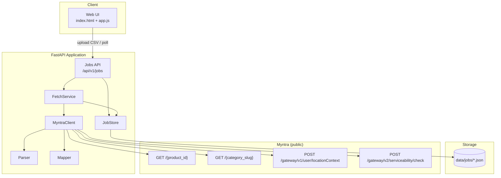
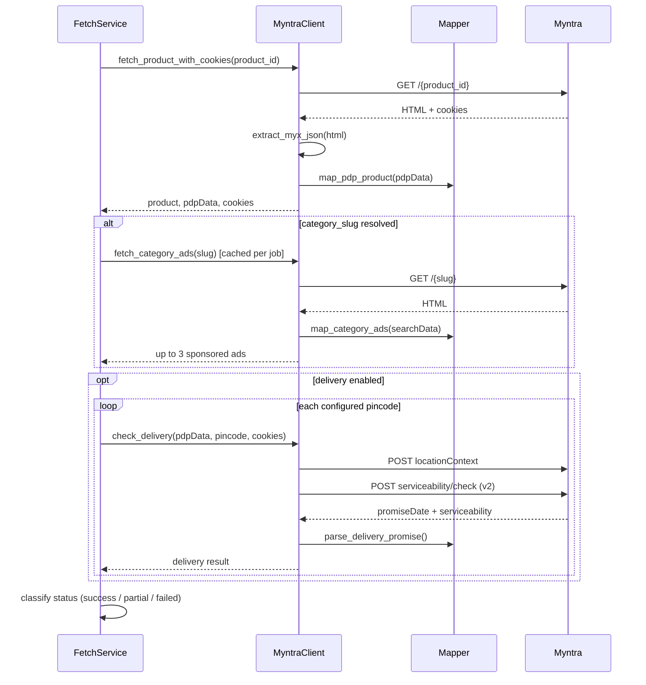

# Architecture

This document describes how **Myntra Fetcher** is structured, how data flows through the system, and the main design decisions behind the implementation.

## Overview

Myntra Fetcher is a batch-oriented web application that:

1. Accepts a CSV of Myntra `product_id` values
2. Fetches public product page data from Myntra
3. Enriches each product with sponsored category ads and delivery estimates
4. Exposes results through a REST API and a static web UI

The system is intentionally simple: a single FastAPI process, file-based job persistence, and direct HTTP calls to Myntra (no browser automation, no external database).

## High-level architecture



## Layered design

The codebase follows a thin layered structure:

| Layer | Location | Responsibility |
|-------|----------|----------------|
| **Presentation** | `app/static/` | Upload form, progress, results table, saved-run history |
| **API** | `app/api/v1/` | HTTP endpoints, request validation, background task dispatch |
| **Services** | `app/services/` | Job orchestration, CSV parsing, per-product fetch workflow |
| **Integrations** | `app/integrations/myntra/` | Myntra HTTP client, HTML parsing, response mapping |
| **Schemas** | `app/schemas/` | Pydantic models for API contracts and result shapes |
| **Core** | `app/core/` | Environment-driven configuration |

Cross-cutting concerns (logging, retries, throttling) live inside `MyntraClient` and `FetchService` rather than in separate middleware.

## End-to-end request flow

### 1. Job creation

```text
User uploads CSV
  → POST /api/v1/jobs
  → FetchService.parse_product_ids()
  → JobStore.create_job()
  → BackgroundTasks.add_task(process_job)
  → 202-style response with job_id + poll URL
```

`parse_product_ids()` validates the `product_id` column, skips invalid rows, deduplicates IDs, and returns warnings for the API response.

### 2. Background processing

```text
FetchService.process_job(job_id)
  → mark job RUNNING
  → for each product_id (sequential):
       → _fetch_single_product()
       → append result
       → update counters + persist to disk
  → mark job COMPLETED (or FAILED on unexpected crash)
```

Jobs are processed **one product at a time** within a job. Concurrency is applied at the HTTP layer via `MyntraClient` (semaphore + delay), not by parallelizing products inside a single job. This keeps rate-limit risk predictable for large CSVs.

### 3. Result retrieval

```text
GET /api/v1/jobs/{job_id}
  → returns job summary + accumulated results (grows as job runs)

GET /api/v1/jobs/{job_id}/download
  → full JSON attachment once job is completed or failed
```

The frontend polls `GET /api/v1/jobs/{job_id}` every few seconds until the job finishes.

## Per-product fetch pipeline

Each product goes through an isolated pipeline. A failure on one product does not stop the job.



### Product page extraction

Myntra embeds server-rendered state in HTML as `window.__myx`. The parser (`parser.py`) locates this blob with bracket matching (not regex) and deserializes it safely.

`pdpData` inside that payload drives:

- Title, description, images, rating, category breadcrumb
- Category slug resolution (for ads)
- Serviceability request payload construction (for delivery)

Product URLs use the numeric ID only:

```text
https://www.myntra.com/{product_id}
```

No product slug is required.

### Category ads

After PDP mapping, the category slug is resolved in this order:

1. `crossLinks` URL slug (e.g. `handbags?f=Gender:women` → `handbags`)
2. Fallback to `analytics.articleType`

The client fetches the category listing page and reads sponsored products from `searchData.results.plaProducts` where `isPLA: true`. Only the **first 3** sponsored results are returned.

Category pages are cached **per job** by slug so multiple products in the same category reuse one listing request.

### Delivery checks

Delivery is optional (`ENABLE_DELIVERY_CHECK`, default `true`). When enabled:

1. The PDP request retains session cookies
2. For each configured pincode, the client calls:
   - `POST /gateway/v1/user/locationContext`
   - `POST /gateway/v2/serviceability/check`

The **v2** endpoint returns `promiseDate` (epoch ms) for `serviceType: DELIVERY`, which is formatted as human-readable text (e.g. `Get it by Sat, Jun 27`) and `estimated_days`. The v3 endpoint only confirms serviceability and is not used for date extraction.

Configured pincodes live in `app/core/config.py` and can be overridden via environment variables.

## Status model

Each product result has one of three statuses:

| Status | Meaning |
|--------|---------|
| `success` | Core product data present; no warnings |
| `partial` | Product fetched but some fields, ads, or delivery checks failed or were incomplete |
| `failed` | PDP unavailable, blocked, or missing essential data (e.g. no title) |

Warnings are collected in `errors[]` without failing the entire product when core data exists. Job-level status (`pending`, `running`, `completed`, `failed`) tracks overall batch progress separately.

## Persistence

Jobs are stored as JSON files under `data/jobs/{job_id}.json`.

`JobStore` provides:

- In-memory cache with thread-safe access (`threading.Lock`)
- Write-through persistence on every update
- Startup reload of existing job files
- Listing of recent jobs for the UI history panel

This design survives process restarts without a database, but does not support multi-instance deployments or concurrent writers across machines.

## Frontend architecture

The UI is a vanilla HTML/CSS/JS single-page experience served from `app/static/`:

| File | Role |
|------|------|
| `index.html` | Layout: upload, status, saved runs, results table |
| `app.js` | CSV upload, polling, history restore, expandable detail panels |
| `styles.css` | Myntra-inspired styling, responsive detail layout |

Key UI behaviors:

- Polls job status until completion
- Persists last viewed `job_id` in `localStorage` and supports `?job=` URL restore
- Renders expandable per-product detail: description, images, delivery table, sponsored ads
- Lists saved runs from `GET /api/v1/jobs`

No frontend build step or framework is used.

## Configuration

Settings are defined in `app/core/config.py` using `pydantic-settings` and loaded from `.env`:

| Setting | Default | Purpose |
|---------|---------|---------|
| `REQUEST_DELAY_SECONDS` | `0.8` | Minimum gap between outbound Myntra requests |
| `MAX_CONCURRENT_REQUESTS` | `3` | Semaphore limit for concurrent HTTP calls |
| `MAX_RETRIES` | `3` | Retry count for transient HTTP failures |
| `REQUEST_TIMEOUT_SECONDS` | `30` | httpx client timeout |
| `ENABLE_DELIVERY_CHECK` | `true` | Toggle delivery gateway calls |
| `DELIVERY_PINCODES` | 5 cities | Pincode map for delivery checks |

## Reliability and rate limiting

`MyntraClient` implements defensive fetching:

- **Semaphore** — caps parallel requests (`MAX_CONCURRENT_REQUESTS`)
- **Throttle** — enforces minimum delay between requests
- **Retries** — backoff on 429/5xx responses
- **Block detection** — small HTML responses and maintenance pages raise `MyntraBlockedError`
- **Per-product isolation** — exceptions are caught in `_fetch_single_product()` and recorded as `failed` results

Custom exceptions in `integrations/myntra/exceptions.py` distinguish parse errors, not-found, and blocked/rate-limited responses.

## Deployment

### Local

```bash
uvicorn app.main:app --reload --host 0.0.0.0 --port 8000
```

### Docker

`Dockerfile` builds the app image; `docker-compose.yml` exposes port `8000` and passes key environment variables.

Static assets are mounted at `/static`; the root route serves `index.html`. Health check: `GET /health`.

## Project structure

```text
app/
  main.py                      # FastAPI app, static mount, health check
  core/
    config.py                  # Settings
  api/v1/
    router.py                  # API router aggregation
    endpoints/jobs.py          # Job CRUD + download
  schemas/
    product.py                 # Pydantic models
  services/
    fetch_service.py           # CSV + batch orchestration
    job_store.py               # JSON file persistence
  integrations/myntra/
    client.py                  # HTTP client
    parser.py                  # window.__myx extraction
    mapper.py                  # PDP, ads, delivery mapping
    exceptions.py              # Integration errors
  static/
    index.html, app.js, styles.css
scripts/
  generate_sample_output.py    # Offline sample JSON generator
tests/                         # Parser, mapper, CSV, delivery unit tests
data/jobs/                     # Persisted job output (gitignored)
```

## Extension points

Reasonable next steps if the system needs to scale or harden:

| Area | Current | Possible upgrade |
|------|---------|------------------|
| Job queue | FastAPI `BackgroundTasks` | Redis + Celery/RQ for long batches |
| Persistence | JSON files on disk | PostgreSQL or S3 for multi-instance deploys |
| Caching | Per-job category slug cache | Redis cache keyed by `product_id` / slug |
| Testing | Unit tests with fixtures | HTML fixture integration tests against recorded responses |
| Scraping | httpx only | Proxy rotation or headless fallback for blocked traffic |

## Key assumptions

1. Myntra continues to expose `window.__myx.pdpData` in PDP HTML.
2. Sponsored ads are represented by `plaProducts` with `isPLA: true` on category pages.
3. Delivery promise dates are available from the v2 serviceability API when PDP session cookies are present.
4. Input CSV contains a `product_id` column with numeric IDs; duplicates are deduplicated per job.

## Related docs

- [README.md](README.md) — setup, API reference, assumptions, and example output shape
